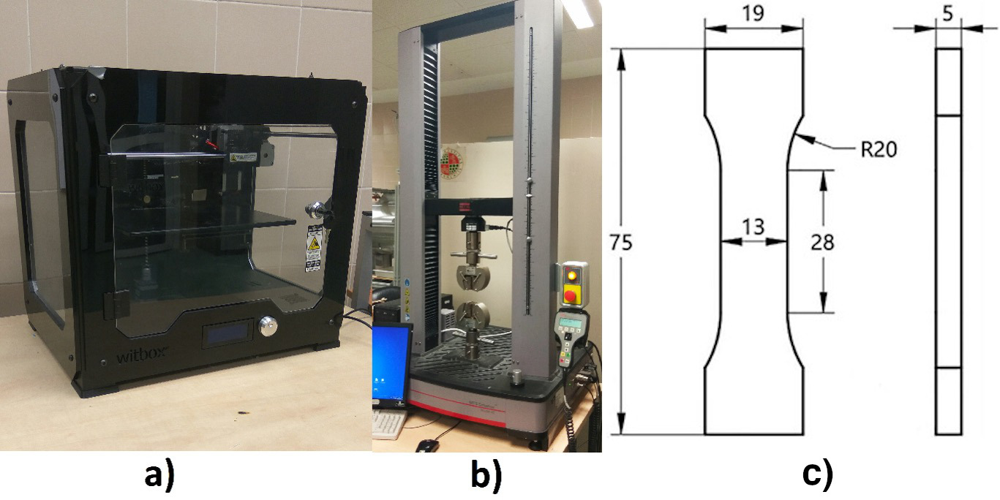

```{r setup, include=FALSE, echo=FALSE}
knitr::opts_chunk$set(echo = FALSE, fig.retina = 3, message = FALSE, warning = FALSE)
options(knitr.kable.NA = '')


library(tidyverse)
library(kableExtra)
library(rmarkdown)
library(knitr)
library(flextable)
#render("Taylor-template.Rmd", output_format = "word_document")
#library(bibtex)


# library(bib2df)
# library <- bib2df("library.bib")
#library$URL <- NA
# 
# df2bib(library, file = "Refs.bib", append = FALSE)
set_flextable_defaults(fonts_ignore=TRUE)
```

<!-- \section*{Highlights} -->
<!-- - Technical viability of recycled materials as substitutes for conventional virgin materials are still limited to particular applications such as prototyping activities -->
<!-- -	The infill density and the orientation are key factors for the tensile strength -->
<!-- -	Recycled materials provide tensile strength close to that of the virgin ones -->
<!-- -	An infill density of 40 %, there is a retention of 58.1 % of the tensile strength -->


# Introduction
Fused filament fabrication (FFF) is a major additive manufacturing technology, which has found considerable number of applications in different types of manufacturing sectors [@Singh2020d; @Sartal2018].
The layer-by-layer principle of manufacturing objects enables a higher degree of flexibility in the product design phase [@Akhoundi2019].
<!-- The FFF process is based on material extrusion, so the material is heated above its melting point and then deposited onto a platform [@Wolszczak2018].  -->
The set of several available printing technologies [@Nam2019] is pushing forward advantages such as the mass customization [@Jiang2016] with complex geometries that involve a great deal of detail, a combination of different materials [@Askari2020], a reduction in the need for assembly and a high utilization rate of raw materials [@Wang2020f].

<!-- 3D printing has developed significantly over time.  -->
<!-- A great development is expected in sectors such as product consumption, medical products and aerospace components [@Peng2018]. -->
<!-- The rapid prototyping market reached $11.86 billion US dollars according to Wohlers 2019 report [@Singh2021], which also forecasts the market to reach 35.6 billion dollars by 2024 [@Forbes2020].  -->


Nowadays, there is a need to find ways to reduce the ecological impact of manufacturing processes, pursuing sustainable and clean manufacturing processes [@Niaki2019;@Peng2018]. 
Researchers are making efforts to identify opportunities for 3D printing on the circular economy paradigm [@Despeisse2016]. 
Moreover, due to the fact that plastic is one of the most highly used materials in the 3D printing industry [@GonzalezHenriquez2019] and given its non-biodegradable nature, plastic is one the most abundant types of waste produced and its impact is well document in the various ecosystems [@Ryberg2019]. 
Thus, reducing the consumption of plastics is of great importance.

A major body of literature arising from the fields of engineering, human–computer interaction, design thinking and software development [@Elverum2016] validates the rationale for the prototyping phase in the early design phases of product development.
According to the prototyping theory, different kinds of prototypes are needed during the new product development phases (e.g. prototypes for desirability, for feasibility, and for viability) [@Menold2017] with the purpose of reducing uncertainties, exploring new ideas, increasing feasibility and/or engaging with users [@Hansen2020]. 
On that basis, a prototype is achieved in terms of certain modelling aims: Model to Link, Model to Test, Model to Communicate, Model to Decide, and Model to Interact [@Menold2017]. 
The use of digital tools allows designers to create highly flexible prototypes that enable short learning cycles at an affordable cost. 
Moreover, the use of 3D printing technology enables the materialization aspect. 
Regardless of whether the printed object is functional or not, it is found to be valuable in design decisions [@Elverum2016].
However, there is a gap in the literature in terms of sustainable manufacturing using 3D printing in the early design phases [@Peng2018]. 
Although the technology offers high efficiency in the use of materials, the democratization of this technology could cause a rebound impact due to the increasing generation and disposal of huge amounts of waste or polluting emissions to fabricate the virgin feedstock required, particularly, in prototyping. 
Without a doubt, the roots of FFF are linked to the rapid prototyping concept [@Campbell2012] and in recent years it has been widely adopted to create functional objects for their designs. Therefore, one question that remains is how to define the most favorable printing conditions to create prototypes in the early phases without compromising the mechanical properties, even for recycled feedstocks. 

Studies on the technical viability of recycled materials as substitutes for conventional virgin materials are still limited to particular applications [@CruzSanchez2020; @Mikula2020]. 
It is important to note that, in most cases, prototypes do not require excellent mechanical properties but the minimum to be handled to allow inspection and measurement. 
Thus, the type of material used and its amount can be further optimized when it comes to prototyping.
  <!-- Mechanical properties in 3DP -->
The mechanical properties are critical for engineering parts, particularly, for 3D printed parts because of the anisotropy [@Lovo2018], which can influence the ultimate tensile strength (UTS) up to about 47 % as it pertains to the manufacturing parameters [@Laureto2018].
Using a systematic literature review, Popescu et al. @Popescu2018 identified key parameters that influence the printed parts, including the raster-to-raster air gap, raster angle, layer thickness, infill density, and build orientation.  
In general terms, it is found that for low values of layer height, the tensile strength of the material is improved [@Tymrak2014a; @Altan2018]. 
Similarly, Yao et al. @Yao2019 identified the importance of the printing orientation in the UTS. Thus, the alignment of the tensile load with the longitudinal axis of the printed fiber will maximize the UTS.
According to Alafaghani et al. @Alafaghani2018 a higher extrusion temperature, an optimized layer thickness, a triangular filling pattern and a higher filling level maximize the strength of the parts. Regarding the printing speed, it has been determined that a higher printing speed with a higher layer thickness leads to lower part strength.

<!-- DRAM -->
In the literature, distributed recycling via additive manufacturing (DRAM) approach emphasizes the technical steps required to reuse plastic waste through the recycling chains for material-extrusion-based 3D printing [@CruzSanchez2020; @Little2020]. 
The use of recycled material, either in the form of raw material or blended with virgin material, is a method of special interest to contribute to sustainable manufacturing [@Zhao2018].
In the DRAM methodology, consumers have an economic incentive to recycle. 
This is because they can use their waste as feedstock for a wide range of consumer products that can be produced for a fraction of the conventional cost of the equivalent products. 
Moreover, 3D printing is especially well suited because it enables the production of parts with (almost) no waste, and could reduce the waste related to the material by more than 40 %, reusing 95 % of the unused material [@Petrovic2011]. 
Currently, most of the cost of 3D printing is associated with filament [@Wittbrodt2013]. 
By recycling raw materials such as Polylactic acid (PLA), one of the most frequently used materials in 3D printing, it is possible to reduce the carbon dioxide emissions that are incurred by transport to landfills or shipping to customers, offering environmental benefits [@Santander2020]. 

<!-- Mechanical properties in DRAM -->
It is important to evaluate the properties of the recycled materials before substituting virgin for recycled materials. 
The use of recycled materials is still uncertain because of the potential changes in the material properties when recycling [@Suarez2020].
Several authors have studied the printing cycles that PLA can withstand until it loses much of its properties [@CruzSanchez2017; @Zhao2018; @Lanzotti2019; @Anderson2017].
There is an agreement that PLA adequately withstands two printing cycles since after a third cycle or more the mechanical properties and viscosity decreased considerably. 
The increase in crystallinity and melting enthalpy and the decrease in cold crystallization enthalpy are attributed to the 3D printing process.
For instance, Kumar et al. @Kumar2018b compared the elongation at break, load at break, flow index, Young’s modulus and breaking stress of recycled Acrylonitrile butadiene styrene (ABS), high impact polystyrene (HIPS) and PLA. 
The PLA showed the highest elongation at break along with the ABS. In addition, the PLA had a higher breaking load and breaking stress, although a smaller Young’s modulus.  
Likewise, Babagowda et al. @Babagowda2018 studied the influence of the percentage of recycled PLA used in the filament (i.e., 10 to 50 %) showing that the smaller the percentage the higher the ultimate tensile strength.  
In summary, the recycling of PLA has certain limitations due to the reduction in the molecular weight with its reuse, resulting in degradation and a decrease in mechanical properties [@Pinho2020].
The viscosity is also reduced with each printing cycle, but it could be corrected by adding virgin plastic [@Zhao2018; @Zhao2018a].

<!-- When recycling, there is a decrease in the properties of the material as a result of the presence of carbonyl groups and superficial pitting due to thermomechanical degradation during the new melting process that takes place during 3D printing [@Zhao2018]. -->

Nevertheless, it is highlighted that it might be uncertain whether a set of optimal parameters for a machine/material/application combination can be transferred to other 3D printers due to the issue of intra-3D printer variability and the variations of the quality of the recycled material. 
Robust methods are needed to develop standards to qualify the process setting minimal requirements for the resistance, dimensional accuracy, replicability, and minimum feature size among the 3D printing technologies [@Rebaioli2017].
Besides, considering the open-source nature of FFF technology, standardized experimental protocols are relevant to enable benchmarking and to serve as a guide for machine selection [@CruzSanchez2014; @Roberson2013].
Therefore, it is crucial to identify the most important parameters that may affect the process quality [@JaisinghSheoran2019].
The present study propose a methodology in three phases to evaluate the tensile strength of both conventional and recycled polylactic acid (PLA) materials. The objective is the assessment of the suitability of the recycled PLA as a replacement in prototyping, though its use may be further extended to other applications. To do so, this research is based on a comprehensive experimental study with three main phases in order to evaluate the influence of several printing parameters on the tensile strength. 


<!-- In section \@ref(section:background), a literature review is presented, focusing on the critical parameters in 3D printing technology and providing readers with an overview on the use of a distributed recycling approach. Then, section \@ref(section:experimental) illustrates the methodology used in this study. In section \@ref(section:findings), the results of the experimental approach is presented. In section \@ref(section:discussion), we discuss the main research outcomes. Finally, section \@ref(section:conclusions) summarizes the main conclusions.  -->

<!-- Several studies seeks the technical feasibility for recycling in laboratory conditions PLA [@CruzSanchez2017; @Zhao2018; @Lanzotti2019], ABS [@Vidakis2020] and PET [@Zander2018], finding that the recycled plastics could a similar performance to their virgin counterparts and they have even been applied in the manufacture of high value products in some sectors such as the automobile [@Zhao2018].  -->


<!-- Similarly, other authors such as @Lanzotti2019 have proved how recycling PLA provides comparable mechanical properties as the virgin material only after a second recycling process. -->


<!-- It is found that this valuable literature is focused on the evaluation and optimization of printed parts that seek the best trade-offs among parameters for a final product. -->
<!-- The aim of the study is to identify the major critical factors affecting the mechanical properties in FFF focusing prototyping purposes, evaluating their impact on the mechanical properties, particularly for both virgin and recycled PLA.  -->
<!-- Thus, based on the results, it is expected to gain a better understanding on the suitability of using recycled materials in 3D printing and how to properly select the printing conditions to guarantee sufficient mechanical resistance in prototypes.  -->
<!-- In order to do that, an experimental plan comprising three phases will be developed.  -->
<!-- This is a complementary approach to the well established literature on FFF. -->

# Experimental procedure {#section:experimental}


## Materials and equipment
The printing materials tested were commercial virgin and recycled PLA characterized by data listed in Table \@ref(tab:tabla1). 
The recycled PLA was comprised of a blend containing 10% virgin PLA.


```{r tabla1, echo=FALSE, warning=FALSE, include=TRUE}
table_1 <- read_csv2("tables/table-1.csv")
table_1 <-  table_1 %>%  set_names(" ", "PLA", "Recycled PLA")

table_1 %>% flextable() %>%
  set_caption("Characterization and processing conditions of the PLA used and the recycled PLA") %>%
  width(j=1:3, width = c(1, 1.5, 1.5)) %>% 
  theme_zebra()
```

<!-- Explanation of the Equipement -->
The specimens were printed with a BQ Witbox, shown in Figure \@ref(fig:machine)a, using the Ultimaker Cura 3.2.1 software.  
<!-- The software used to generate the printing code was the Ultimaker Cura 3.2.1.  -->
For tensile testing, a MTS Criterion 43 universal testing machine (Figure \@ref(fig:machine)b) was used, selecting a strain rate of $0.5~mm/min.$.
The mechanical specimens were manufactured according to the dimensions depicted in Figure \@ref(fig:machine)c.


```{r machine, out.width='0.9\\linewidth', fig.cap="Equipment used in the study: a) 3D printer, b) Universal testing machine and c) Mechanical sample.", fig.align='center'}

```


## Methodology

<!-- Intro on Fractional design -->
The experimental plan included three different phases (Figure \@ref(fig:Methodology)) to carry out a comprehensive study with a limited number of tests that do not compromise the reliability of the results. 

<!-- Explaining the phase I -->
The main goal of *Phase I* is to identify and discard factors depending on their influence on the response variable. 
The response variable chosen was the maximum load attained during the testing of the specimen [@Kumar2018b; @Chacon2017].
We have chosen to use fractional designs to minimize the number of tests, being used as screening designs. 
The design included only specimens printed in the horizontal orientation. 
The use of random order made it possible to guarantee that the hypothesis stating that the errors are independently distributed random variables was fulfilled [@Montgomery2001]. 
<!-- Based on the literature research presented in section \@ref(section:background),  -->
The critical parameters for the study are the *layer height* (0.15 and 0.3 mm) and *infill pattern* (tri-hexagonal and grid) [@Singh2019; @Tanveer2019].
In addition, taking into account the goal of sustainable manufacturing (i.e. trying to optimize the consumption of material), but also productivity (i.e. trying to minimize printing times), *infill density* (60 and 100 %) and *printing speed* (40 and 80 mm/s) were considered. 
<!-- These four factors were selected using two levels for each, with wide ranges.  -->
The printing temperature was 210°C, which was the recommended temperature for PLA material. 
To conclude this phase, an analysis of variance (ANOVA) is made to identify the factors influencing the response variable.


<!-- Explaining the phase II -->
The main goal of *Phase II* is to study in more detail the influence of the most influential factor according to *Phase I*.
The intent therefore is to focus on how the response variable evolves by varying the most influential factor. 
For that reason, an extension of the factor levels was established. 
On the other hand, the criteria selection of levels for the other three factors aimed at minimizing the printing time.

<!-- Explaining the phase III -->
Finally, *Phase III* aimed at evaluating the influence of the anisotropy based on the printing orientation, which may notably affect the tensile strength.
Because of the anisotropy, the UNE 116005:201246 [@UNE] standard requires printing the specimens in three different orientations: edgewise, horizontal and vertical, testing five samples in each orientation. 
This phase included the printing of 15 specimens of both materials.


```{r Methodology, out.width='0.7\\linewidth', fig.cap="Summary of the three phases of the experimental plan.", fig.align='center'}

#download.file("https://raw.githubusercontent.com/fabbiocrux/Figures/main/Metodologies/Methodology-Univigo.svg", "Figures/Methodology.svg")
knitr::include_graphics('Figures/Methodology.pdf')

```

# Findings {#section:findings}


```{r table.S2, echo=FALSE, message=FALSE, include=FALSE}
fase1 <- read_csv2("Datos/Phase-1.csv") 
fase2 <- read_csv2("Datos/Phase-2.csv")
fase3 <- read_csv2("Datos/Phase-3.csv") 

table.fase2 <- 
  fase2 %>% kable(format = "latex", booktabs = T, linesep = "", digits = 3)
  

table.fase3 <- 
  fase3 %>% kable(format = "latex", booktabs = T, linesep = "", digits = 3) 

#cbind(fase.1, fase.2)
#kable( fase2, format = "latex")

#kable(list(fase1, fase2), format = "latex")  #, booktabs = T, linesep = "", digits = 3) 
  #kable_styling(latex_options = "striped")
```


##  Phase I: Screening phase

Table \@ref(tab:phase1) summarizes the experimental strategy with the results of the maximum load attained during this screening phase.
A total of 16 samples were tested.

```{r phase1, echo=FALSE, message=FALSE, include=TRUE}
# Reading the datos

fase1 <- read_csv2("tables/Phase-1.csv") 

# table.fase1 <-
#   fase1 %>% set_names("Material", "Layer Height (mm)", "Infill Pattern", "Infill Density (%)", "Printing Speed (mm/s)", "Max Load (kN)")
# table.fase1$`Max Load (kN)` <- table.fase1$`Max Load (kN)` %>% round( digits=2)

fase1 %>% flextable() %>%
  set_caption("Results of the Phase I") %>%
  fontsize(size=10, part = "all") %>% 
#  width(j=1:3, width = c(1, 1.5, 1.5)) %>% 
  theme_zebra() 
  # footnote( i = 1, j = 2:5,
  #           value = as_paragraph(
  #             c("Layer height (LH)",
  #               "Infill pattern (IP)",
  #               "Infill density (ID)",
  #               "Printing speed (PS)")
  #           ),
  #           ref_symbols = c("a", "b", "c", "d"),
  #           part = "header", inline = FALSE)


#   
#   kable(booktabs = T, linesep = "", digits = 2,
#       caption = "Results of the Phase 1.")  %>%
#   kable_styling(latex_options = "striped", font_size = 7) %>%
#   footnote(general = "Layer height (LH), Infill pattern (IP), Infill density (ID), Printing speed (PS)",
# threeparttable = T)


```


In general, shortly after attaining the maximum load, fracture of the specimen occurred. However, the nature of the fracture was not homogeneous as shown in Figure \@ref(fig:fase1)a. 
In most cases, the specimens showed fragile behavior, and the fracture, either horizontally or with a lower inclination angle, was clean. 
However, for the recycled material, the specimens presented ductile behavior and, properly, the fracture did not occur after the maximum load was attained. 
In these cases, the tensile tests were cancelled after the maximum load was attained, without reaching a complete fracture. 
The breakage in these cases occurred at a 45º angle and, in the case of the RE-2 specimen, two parallel fracture lines can be clearly seen. 
The images of the fractured specimens did not allow us to observe a clear relation of the fracture to the printing conditions. 
However, the fracture behavior may relate to that explained by Yao et al @Yao2019.
The authors identified two different types of fracture: in-layer and interlayer. 
In general, the interlayer fracture occurs at the interface of two layers when printing in a vertical position, even when varying the printing orientation up to 45° from the vertical position. 
In-layer fracture is more likely when using an edgewise position (or, inclined up to 45° from that position). 
In this case, the printing direction is the same as the tensile stress direction, which also happens when the horizontal orientation is used. 
In these cases, the material layer is not intact after the fracture. 
As a result, it is likely that both modes (in-layer and interlayer fractures) coexist in this study, which may explain the heterogeneity of the different fractures.


```{r fase1, fig.cap='Phase I: screening tests to identify significant factors based on DoE. (a) Tensile sample of the Phase I. (b) Boxplots to identify significant factors based on DoE', fig.subcap=c(' ', ' '), out.width= c('65%', '100%'), fig.ncol=1, fig.align='center'}
knitr::include_graphics(c('Figures/Probetas-Fase-1.jpg',
                          'Figures/Phase-1-2-correction.jpg'))
```


```{r ANOVAS, include=FALSE}
# Reading data
fase1 <- read_csv2("tables/Phase-1.csv")
names(fase1) <- c("Material", "LH", "IP", "ID", "PS", "ML", "Young")

# Model witht the Load
Load_model <- lm(ML ~ LH + ID + IP + PS + Material, data = fase1)
# Model witht the Young
Young_model <- lm(Young ~ LH + ID + IP + PS  + Material, data = fase1)

 # HAciendo los Anovas
Load_model.anv <-  anova(Load_model) %>% round(3)
Young_model.anv <- anova(Young_model) %>% round(3)


# Extract the residuals from the models
Residuals <- c()
 Residuals$Load <- residuals(object = aov(Load_model) )
 Residuals$Young <- residuals(object = aov(Young_model))
# Run Shapiro-Wilk test
shapiro.test(x = Residuals$Load )
shapiro.test(x = Residuals$Young)


Anovas <-
  data.frame(rbind(c(
                  "Df", "Sum Sq", "Mean Sq", "F value", "Pr(>F)", 
                  "Df", "Sum Sq", "Mean Sq", "F value", "Pr(>F)"),
                    cbind(Load_model.anv, 
                          Young_model.anv))
                ) 

# Anovas <- Anovas %>% mutate(across(is.numeric, ~ round(., 3)))


#colnames(Anovas) <- c("", "", "", "","", "", "", "", "","")
colnames(Anovas) <- LETTERS[1:10]
row.names(Anovas) <- c("", "Layer Height (mm)", "Infill Density (%)","Infill Pattern",  "Printing Speed (mm/s)", "Material", "Residuals")

```


```{r anova-phase1, include=TRUE}
Anovas[3,5] <- paste0("5.2e-11","***")
Anovas[5,5] <- paste0("0.007","**")
Anovas[3,10] <- paste0("1.8e-09","***")


Anovas %>% rownames_to_column(var = "Variable") %>% flextable() %>%
   set_caption("ANOVA results at 95\\% significance level for Maximal load and Young modulus variables") %>%
  delete_part( part = "header") %>% 
   add_header( Variable = "Variable",
               A = "Maximal load",
               B = "Maximal load",
               C = "Maximal load",
               D = "Maximal load",
               F = "Young",
               G = "Young",
               H = "Young",
               I = "Young",
               J = "Young",
               top = TRUE ) %>% 
  merge_h( part = "header") %>% 
   fontsize(size=9, part = "all") %>% 
  #fit_to_width(max_width = 5) %>% 
  width(j=1:11, width = c(1, 0.2,0.4, 0.4, 0.4, 0.7, 
                             0.2,0.7, 0.7, 0.6, 0.7)) %>% 
   theme_zebra() %>% 
  vline( j = c(1,6), part = "all") %>% 
  footnote( i = 1, j = c(6,11),
            value = as_paragraph(
              c("Signif. codes:  0 ‘***’ 0.001 ‘**’ 0.01 ‘*’ 0.05 ‘.’ 0.1 ‘ ’ 1"))
  )  
  #           ),
  #           ref_symbols = c("*"),
  #           part = "header", inline = TRUE)
# 
# 
# Anovas %>% 
#    kbl(booktabs = T,
#        caption = "ANOVA results at 95\\% significance level.",
#        linesep = "")  %>%
#   kable_styling(latex_options = c("striped", font_size = 5, "hold_position", full_width = F)) %>% 
#   column_spec (c(1,6), border_right = T) %>% 
#   add_header_above(c("", "Maximal load" = 5, "Young modulus" = 5))
# 
#   


# Percentage of ID
#round(anv.fase.1$`Sum Sq`[3]/ total,3)*100
# Percentage of Material
#round(anv.fase.1$`Sum Sq`[5]/ total,3)*100
```


Table \@ref(tab:anova-phase1) lists the ANOVA using R software in order to identify the influential factors on the maximal load and Young's modulus.
As a criterion, critical factors for the response variable were those with p-values lower than 0.05.
Shapiro-Wilk normality tests were made to verify the normality of the residuals for both models. 
Figure \@ref(fig:fase1)b illustrates the boxplots of the results considering each of the factors.
  <!-- Results -->
Thus, it can be clearly identified how only the infill density (lowest p-value) and the type of material were statistically significant factors for the maximum load and for the Young's modulus.
The contribution to the total variance of the maximal load model was 97.3 % and 1.3 % for the infill density and material type, respectively. 
  <!-- Young modulus -->
In the case of the Young' modulus, 


Thus, when manufacturing new parts, infill density is a key factor for guaranteeing adequate tensile strength.


## Phase II: Focusing


```{r phase2, fig.cap="Phase II: Evaluation of the infill density in the mechanical load.", fig.subcap=c(" ", " "), out.width= c('45%', '50%'), fig.pos="!h", fig.align='center', fig.nrow=1}

knitr::include_graphics(c('Figures/Probetas-Fase-2.jpg',
                        'Correciones/Phase-2-corrected.jpg'))
```


The main goal of *Phase II* is to evaluate in more detail the influence of infill density on the tensile strength based on Phase I. 
Therefore, five levels of the infill density were chosen: 40, 55, 70, 85 and 100 %. Regarding the selection of the other printing parameters, the main criterion was the reduction of the printing time. 
Therefore, the experimental conditions were layer height of 0.3 mm, tri-hexagonal infill pattern and printing speed of $80~mm/s$ with an estimated printing time of 20 min. 
A total of 10 samples were manufactured.

Figure \@ref(fig:phase2)a shows the fracture of the specimens tested in *Phase II*. Regarding the fracture, the results were similar to those of the *Phase I* (i.e., more ductile behavior for the recycled PLA specimens). 
The interesting element in this phase is presented in \@ref(fig:phase2)b where the maximum load versus infill density for both materials is illustrated.


From Figure \@ref(fig:phase2), it is possible to appreciate that there are two different regions. 
In the A region, which comprises infill densities ranging from 40 to 80 %, the slope of the curve grows slowly with an approximately linear trend. 
Moreover, in the B region, from 80 to 100 %, the increase of the tensile strength becomes more pronounced. 
Regarding the type of material, it is clear that virgin PLA moderately outperforms recycled PLA. 
These results are in agreement with studies on the comparison of the performance of recycled and virgin PLA [@CruzSanchez2017] in which there was found to be a difference of about 10 % in the tensile strength in the first recycling cycles. 
However, the difference notably increased as the infill density approached 100 %. The results obtained closely match those presented by Wang et al @Wang2020h.
In their study, the authors studied infill densities of 20, 40, 60, 80 and 100 % and the evolution of the tensile strength is similar to that shown in Figure \@ref(fig:phase2).


Based on the results, it appears that a reduction from 100 to 40 % of the infill density implies a relatively limited reduction, on average 41.7 %, of the maximum load supported for both types of materials. 
Although the number of measured points is reduced, it is possible to model the relation between the maximum load and the infill density for the two tested materials by means of polynomial regressions that are plotted in the figure. 
The models may help to anticipate the tensile strength of a part based on the infill density. 
Based on the models developed, it is possible to highlight that recycled PLA is a suitable substitute for virgin PLA guaranteeing similar tensile strength.  


<!-- Moreover, by developing models for the mechanical properties, it is possible to minimize the material consumption for both virgin and recycled materials satisfying the mechanical resistance requirements.  -->
<!-- Thus, by accurately knowing the influence of the printing conditions on the mechanical resistance, it is possible to advance towards sustainable manufacturing. -->

\newpage
## Phase III: Study on the printing orientation

In this final phase, the main goal is to test the influence of the building orientation according to the UNE 116005:2012 [@Garcia-Dominguez2020] standard. 


```{r phase3, fig.cap='Phase III: Evaluation of the anisotropy. a) Specimens after tensile test in  Phase III. b) Average of the load obtain for each build orientation.', fig.subcap=c(' ', ' '), out.width= c('49%', '49%'), fig.ncol=2, fig.align='center', fig.pos='!h', include=TRUE}
knitr::include_graphics(c('Figures/Probetas-Fase-3.jpg',
                          'Figures/Phase-3.jpg'))
```


Five specimens for each of the orientations (edgewise, horizontal and vertical) for both materials were manufactured. 
The selected printing conditions were infill density of 50 %, printing speed of 80 mm/s, tri-hexagonal infill pattern and layer height of 0.3 mm, with the objective of limiting the use of material and the time required for printing. 
A total of 30 samples were tested.


Figure \@ref(fig:phase3)a shows the images of the tested specimens displaying the same type of fracture as in the first two phases. 
It is interesting to evaluate the reduction in the maximum load depending on the type of material and the orientation in which the specimens were printed.

Figure \@ref(fig:phase3)b details the maximum load and the mean values for the five specimens at each orientation. 
From the results, it is clear that the horizontal orientation is the one that provided the higher tensile strength, followed by the edgewise orientation. 
Likewise, the virgin samples performed better than the recycled samples.

The vertical orientation provided the worst results due to the deposition of the layers perpendicular to the tensile direction. 
These results correspond to those by Corapi et al @Corapi2019 and Wang et al @Wang2020h. 
For the recycled material, there is a slight decrease in the maximum load obtained from 6.71 to 13 % depending on the orientation with respect to the virgin values. Specifically, the biggest reduction in the load takes place in the vertical orientation, which demonstrates the highest decrease at 13 %. 
However, the other two orientations are more adequate for substituting the recycled material for the virgin material, with a limited reduction in the tensile strength (6.71 to 7.93 %).


# Discussion and limits of the results {#section:discussion}

One of the systemic problems of plastic waste involves dependency of the indiscriminate disposal of plastics, which carries multiple risks because many plastic products contain additives that modify their physico-mechanical properties, making recycling/reuse difficult [@Wagner2020].
The use of 3D printing technology for prototyping is not exempt from this societal issue. The main purpose of this article is to assess the extent to which the influence of printing parameters affects the tensile strength. 
While a large body of literature is focused on the optimization of the parameters for obtaining functional printed objects using 100 % of the printed material, the approach taken here is to observe the influence of a wide range of factors that are critical within conventional printing ranges. 
This type of approach enables designers and users to utilize printing setups that are designed for object prototypes, providing certainty about the quality of the printed products.


One of the main results of this study demonstrates that there is a reduction about 41.7% (on average) in the maximum load supported for PLA (virgin and recycled) when the infill density changes from 100 to 40 %.
Moreover, it could be inferred from the results that an infill density of 40 % retained 58.1 % of the tensile strength. 
This is a relevant insight for prescriptions of minimal conditions for 3D printing. Moreover, the use of recycled assets in the printing process may be a relevant method, considering the current priorities of the European Union in regard to circular economy and carbon-neutral strategy ambitions [@Schwarz2021].
Also, there is great development in applications using distributed recycling approaches.
For instance, Nur-A-Tomal et al. @Nur-A-Tomal2020 presented a valuable example of waste-to-wealth to use waste plastic toys retaining the original color of waste plastic to fabricate new products. Certainly more research is required for the development of complete closed-loop case studies for prototyping purposes based on material type, validating technical, ecological and economic feasibility [@CruzSanchez2020; @Sauerwein2019].

There are certain limitations to this work in the perspective of materials and parameters tested. 
Certainly, the use of other materials is needed to confirm the main findings. 
Moreover, other factors are needed in order to consider the quality of a prototype. Clearly, other variables, such as aesthetic design, dimensional accuracy and surface quality [@Jin2017] are also key variables to include for the printed objects in addition to the mechanical properties in the prototypes where the main goal is user acceptability [@Sauer2009;@Sauer2010].
Nevertheless, this is an ongoing study in which the main purpose is the statistical validation of the minimal conditions to promote the use of recycled materials in prototyping.


# Conclusions {#section:conclusions}

The present study proposes a comprehensive experimental program to analyze the Fused Filament Fabrication process based on the tensile strength using virgin PLA and recycled PLA. The paper aims to improve the sustainability of the 3D printing process, proposing a methodology based on Design of Experiments approach in order to assess the technical feasibility of the substitution of recycled filaments for virgin ones by means of a better knowledge on the influence of the printing conditions. The final purpose in the long term is to recognize the technology affordance of prototyping side of additive manufacturing  as a design tool to better ensure consumer acceptance and less waste [@Kohtala2015a].

To a great extent, the printing conditions determined the tensile strength of the specimens. Specifically, the factor that most influenced the maximum load was the infill density.
The influence of the infill density on the maximum load made it possible to identify two different regions: from 40 to 80 %, linear behavior with a slight slope, and from 80 to 100 % where the maximum load notably increases to a greater extent. In general, the fracture of the virgin material corresponded to that of a fragile material, while the fracture of the recycled material showed more ductile behavior.

The selected orientation for printing is of great importance because of the anisotropy. The horizontal orientation allowed to attain a higher maximum load, while the vertical orientation provided a lower value due to the fact that no layers were deposited in the tensile direction. 
Our results support the main argument for the substitution of recycled PLA for virgin PLA, advancing towards sustainable manufacturing. It was found that, when using an infill density of 40 %, there is a retention of 58.1 % of the tensile strength. Despite the fact that recycled PLA offers slightly lower tensile strength, by properly selecting the printing conditions, it could be close to that of the virgin PLA. Particularly, when using the edgewise and horizontal orientations, (ie., from 3 to 8 %).
Future research needs to evaluate the quality of a (recycled) prototype including quality aspects other than tensile aspects such as aesthetics, accuracy. 
Moreover, the acceptability of recycled products that can be technical printable is a major milestone. 


\newpage
# Acknowledgements
The authors would like to thank the “Mechanical and Energy Engineering” TEP 250 research group and the Lorraine Fab Living Lab

The authors thank TEP 250 research group and to the Lorraine Fab Living Lab\textsuperscript{\textregistered}.
This research has received funding from the European Union’s Horizon 2020 research and innovation program under grant agreement No. 869952.


# Declaration of interest statement

The authors report no declarations of interest.


\newpage
# References